<h1 align="center">Hi, I'm Darin Chau</h1>
<h3 align="center">Undergraduate software developer from HKUST</h3>

- 🏫 I'm a student in Mathematics and Computer Science (Hong Kong University of Science and Technology)
- 🌱 I'm currently learning **Hugging Face Libraries**, **NoSQL databases**
- 🔎 I have conducted research work in Mathematics (Cluster algebra) and Computer Science (CNN Crowd Counting)
- 🎹 I am proficient at piano performance **(DipABRSM)**

<h3 aligh="left">Connect with me:</h3>

<h3 aligh="left">Languages and tools:</h3>

### My Stats:

Last updated: 30/10/2023
